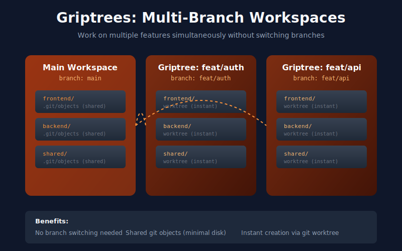
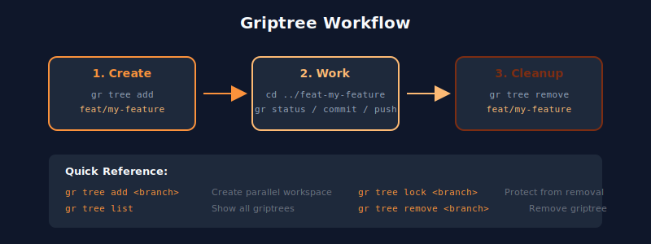

<p align="center">
  
</p>

<p align="center">
  <a href="https://crates.io/crates/gitgrip"></a>
  <a href="https://github.com/laynepenney/gitgrip/blob/main/LICENSE"></a>
  <a href="https://crates.io/crates/gitgrip"></a>
</p>

<p align="center">
  Multi-repo workflow tool for synchronized branches, linked PRs, and atomic merges.
</p>

---

Manage multiple related repositories as a single workspace with synchronized branches, linked pull requests, and atomic merges.

Inspired by Android's [repo tool](https://source.android.com/docs/setup/create/repo), gitgrip brings manifest-based multi-repo management to any project.

## Features

- **Manifest-based configuration** - Define all your repos in a single YAML file
- **Multi-platform support** - Works with GitHub, GitLab, and Azure DevOps (even mixed in one workspace)
- **Synchronized branches** - Create and checkout branches across all repos at once
- **Linked PRs** - Create pull requests that reference each other across repos
- **Atomic merges** - All-or-nothing merge strategy ensures repos stay in sync
- **Status dashboard** - See the state of all repos at a glance

## Installation

### Homebrew (macOS/Linux)

```bash
brew tap laynepenney/tap
brew install gitgrip
```

### From crates.io

```bash
cargo install gitgrip
```

### From GitHub Releases

Pre-built binaries for Linux, macOS (Intel & Apple Silicon), and Windows are available on the [releases page](https://github.com/laynepenney/gitgrip/releases).

### From Source

```bash
git clone https://github.com/laynepenney/gitgrip.git
cd gitgrip
cargo build --release

# Binary is at target/release/gr (or gr.exe on Windows)
# Install to ~/.cargo/bin:
cargo install --path .
```

## Quick Start

### 1. Create a manifest repository

Create a new repo to hold your workspace manifest (e.g., `my-workspace`), then add a `manifest.yaml`:

```yaml
version: 1

manifest:
  url: git@github.com:your-org/my-workspace.git

repos:
  frontend:
    url: git@github.com:your-org/frontend.git
    path: ./frontend
    default_branch: main

  backend:
    url: git@github.com:your-org/backend.git
    path: ./backend
    default_branch: main

  shared:
    url: git@github.com:your-org/shared-libs.git
    path: ./shared
    default_branch: main

settings:
  pr_prefix: "[cross-repo]"
  merge_strategy: all-or-nothing
```

### 2. Initialize a workspace

**From a manifest URL:**
```bash
gr init git@github.com:your-org/my-workspace.git
```

**From existing local directories:**
```bash
# Auto-scan current directory for git repos
gr init --from-dirs

# Scan specific directories
gr init --from-dirs --dirs ./frontend ./backend

# Interactive mode - preview and edit manifest before saving
gr init --from-dirs --interactive
```

This creates `.gitgrip/manifests/` with the manifest configuration.

### 3. Start working

```bash
# Check status of all repos
gr status

# Create a feature branch across all repos
gr branch feature/new-feature

# Make changes, commit in each repo, then create linked PRs
gr pr create --title "Add new feature"

# Sync all repos with latest from remote
gr sync
```

## Commands

| Command | Description |
|---------|-------------|
| `gr init <url>` | Initialize workspace from manifest repo |
| `gr init --from-dirs` | Initialize workspace from existing local directories |
| `gr sync` | Pull latest from all repos (parallel by default) |
| `gr sync --sequential` | Pull repos one at a time |
| `gr status` | Show status of all repos |
| `gr branch [name]` | Create or list branches |
| `gr checkout <branch>` | Checkout branch across repos |
| `gr checkout -b <branch>` | Create and checkout branch in one command |
| `gr add [files]` | Stage changes across repos |
| `gr diff` | Show diff across repos |
| `gr commit -m "msg"` | Commit across repos |
| `gr push` | Push across repos |
| `gr pr create` | Create linked PRs |
| `gr pr status` | Show PR status |
| `gr pr merge` | Merge all linked PRs |
| `gr pr checks` | Show CI check status |
| `gr pr diff` | Show PR diff |
| `gr repo add <url>` | Add a new repository to workspace |
| `gr repo list` | List all repositories |
| `gr repo remove <name>` | Remove a repository |
| `gr group list` | List all groups and repos |
| `gr group add <group> <repos>` | Add repos to a group |
| `gr group remove <group> <repos>` | Remove repos from a group |
| `gr manifest schema` | Show manifest schema specification |
| `gr forall -c "cmd"` | Run command in each repo |
| `gr tree add <branch>` | Create a worktree-based workspace |
| `gr tree list` | List all griptrees |
| `gr tree remove <branch>` | Remove a griptree |
| `gr tree return` | Return to griptree base branch, sync, and optionally prune feature branch |
| `gr pull` | Pull latest changes across repos |
| `gr rebase` | Rebase across repos |
| `gr rebase --upstream` | Rebase onto per-repo upstream (griptree-aware) |
| `gr grep <pattern>` | Search across all repos |
| `gr prune` | Clean up merged branches (dry-run) |
| `gr prune --execute` | Delete merged branches |
| `gr gc` | Run garbage collection across repos |
| `gr cherry-pick <sha>` | Cherry-pick commits across repos |
| `gr ci run/list/status` | CI/CD pipeline operations |
| `gr link` | Manage file links |
| `gr run <script>` | Run workspace scripts |
| `gr env` | Show environment variables |
| `gr bench` | Run performance benchmarks |
| `gr completions <shell>` | Generate shell completions |

### Command Details

#### `gr init <manifest-url>`

Initialize a new workspace by cloning the manifest repository and all defined repos.

#### `gr init --from-dirs`

Initialize a workspace from existing local git repositories. Discovers repos, extracts remote URLs and default branches, and generates a manifest.

| Option | Description |
|--------|-------------|
| `--from-dirs` | Create workspace from existing directories |
| `--dirs <paths>` | Specific directories to scan (default: all subdirs) |
| `-i, --interactive` | Preview manifest and confirm before writing |

**Features:**
- Auto-detects remote URLs and default branches
- Handles duplicate directory names with auto-suffixing
- Initializes manifest as a git repository with initial commit
- In interactive mode, edit the generated YAML before saving

#### `gr sync [options]`

Pull latest changes from the manifest and all repositories. Syncs in parallel by default for faster performance.

| Option | Description |
|--------|-------------|
| `--sequential` | Sync repos one at a time (slower but ordered output) |
| `--group <name>` | Only sync repos in this group |
| `-f, --force` | Force sync even with local changes |
| `--reset-refs` | Hard-reset reference repos to configured upstream branches |

#### `gr status`

Show status of all repositories including branch, changes, and sync state.

#### `gr checkout <branch>`

Checkout a branch across all repos. Can also create branches with the `-b` flag.

| Option | Description |
|--------|-------------|
| `-b` | Create branch if it doesn't exist |
| `--base` | Checkout the griptree base branch (griptree workspaces only) |

#### `gr branch [name]`

Create a new branch across all repositories, or list existing branches. Manifest repo is always included.

| Option | Description |
|--------|-------------|
| `-r, --repo <repos...>` | Only operate on specific repos |
| `-d, --delete` | Delete the branch |
| `-m, --move` | Move commits to new branch |

#### `gr pr create`

Create linked PRs across repos with changes.

| Option | Description |
|--------|-------------|
| `-t, --title <title>` | PR title |
| `-b, --body <body>` | PR body |
| `-d, --draft` | Create as draft |
| `--push` | Push branches first |

#### `gr pr merge`

Merge all linked PRs atomically.

| Option | Description |
|--------|-------------|
| `-m, --method <method>` | merge, squash, or rebase |
| `-f, --force` | Merge even if checks pending |
| `-u, --update` | Update branch from base if behind, then retry merge |
| `--auto` | Enable auto-merge (merges when all checks pass) |

#### `gr repo add <url>`

Add a new repository to the workspace. Parses the URL, updates the manifest, and optionally clones the repo.

| Option | Description |
|--------|-------------|
| `--path <path>` | Local path (default: `./<repo-name>`) |
| `--name <name>` | Name in manifest (default: from URL) |
| `--branch <branch>` | Default branch (default: `main`) |
| `--no-clone` | Only update manifest, skip cloning |

If the workspace is on a feature branch, the new repo will be checked out to that branch automatically.

#### `gr forall -c "<command>"`

Run a command in each repository (like AOSP's `repo forall`).

| Option | Description |
|--------|-------------|
| `-c, --command` | Command to run (required) |
| `-r, --repo <repos...>` | Only run in specific repos |
| `--include-manifest` | Include manifest repo |
| `--continue-on-error` | Continue if command fails |

Environment variables available in command:
- `REPO_NAME` - Repository name
- `REPO_PATH` - Absolute path to repo
- `REPO_URL` - Repository URL

## Manifest Format

The manifest file (`manifest.yaml`) defines your workspace:

```yaml
version: 1

manifest:
  url: git@github.com:your-org/workspace.git

repos:
  repo-name:
    url: git@github.com:your-org/repo.git
    path: ./local-path
    default_branch: main

settings:
  pr_prefix: "[cross-repo]"
  merge_strategy: all-or-nothing
```

### Merge Strategies

- **all-or-nothing** - All linked PRs must be approved before any can merge
- **independent** - PRs can be merged independently

## Multi-Platform Support

gitgrip supports multiple hosting platforms. The platform is auto-detected from the repository URL.

### Supported Platforms

| Platform | URL Patterns |
|----------|--------------|
| GitHub | `git@github.com:org/repo.git`, `https://github.com/org/repo.git` |
| GitLab | `git@gitlab.com:group/repo.git`, `https://gitlab.com/group/repo.git` |
| Azure DevOps | `git@ssh.dev.azure.com:v3/org/project/repo`, `https://dev.azure.com/org/project/_git/repo` |
| Bitbucket | `git@bitbucket.org:org/repo.git`, `https://bitbucket.org/org/repo.git` |

### Authentication

Each platform requires its own authentication:

**GitHub:**
```bash
export GITHUB_TOKEN=your-token
# or
gh auth login
```

**GitLab:**
```bash
export GITLAB_TOKEN=your-token
# or
glab auth login
```

**Azure DevOps:**
```bash
export AZURE_DEVOPS_TOKEN=your-pat
# or
az login
```

**Bitbucket:**
```bash
export BITBUCKET_TOKEN=your-app-password
```

### Mixed-Platform Workspaces

A single manifest can contain repos from different platforms:

```yaml
repos:
  frontend:
    url: git@github.com:org/frontend.git
    path: ./frontend

  backend:
    url: git@gitlab.com:org/backend.git
    path: ./backend

  infra:
    url: https://dev.azure.com/org/project/_git/infra
    path: ./infra
```

### Self-Hosted Instances

For GitHub Enterprise, GitLab self-hosted, or Azure DevOps Server, add a `platform` config:

```yaml
repos:
  internal:
    url: git@gitlab.company.com:team/repo.git
    path: ./internal
    platform:
      type: gitlab
      baseUrl: https://gitlab.company.com
```

## Griptrees (Multi-Branch Workspaces)

Work on multiple branches simultaneously without switching. Griptrees use git worktrees to create parallel workspace directories.

<p align="center">
  
</p>

```bash
# Create a griptree for a feature branch
gr tree add feat/new-feature

# Creates a sibling directory with all repos on that branch:
# ../feat-new-feature/
#   ├── frontend/
#   ├── backend/
#   └── shared/

# Work in the griptree
cd ../feat-new-feature
gr status

# List all griptrees
gr tree list

# Lock to prevent accidental removal
gr tree lock feat/new-feature

# Remove when done (branches are preserved)
gr tree remove feat/new-feature
```

<p align="center">
  
</p>

**Upstream Tracking:**

Each griptree records per-repo upstream defaults so repos can track different branches:

```bash
# tree add sets branch tracking to each repo's configured upstream
gr tree add feat/new-feature

# Sync uses per-repo upstream when on the griptree base branch
# and repairs missing upstream tracking automatically
gr sync

# Rebase onto each repo's configured upstream
gr rebase --upstream

# Return to the griptree base branch
gr checkout --base

# Optional all-in-one post-merge return flow
gr tree return --autostash --prune-current --prune-remote
```

**Benefits:**
- No branch switching required
- Shared git objects (fast creation, minimal disk usage)
- Independent working directories
- Per-repo upstream tracking (different repos can target different branches)

## Shorthand

Use `gr` as the primary command:

```bash
gr status
gr sync
gr branch feature/foo
```

The long form `gitgrip` also works.

## Shell Completions

Generate shell completions for tab completion:

```bash
# Bash
gr completions bash > ~/.local/share/bash-completion/completions/gr
# Or add to ~/.bashrc:
eval "$(gr completions bash)"

# Zsh
gr completions zsh > ~/.zfunc/_gr
# Or add to ~/.zshrc:
eval "$(gr completions zsh)"

# Fish
gr completions fish > ~/.config/fish/completions/gr.fish

# PowerShell
gr completions powershell >> $PROFILE
```

Supported shells: `bash`, `zsh`, `fish`, `elvish`, `powershell`

## Requirements

- Git
- Platform CLI (optional, for token auth fallback):
  - GitHub: `gh` CLI
  - GitLab: `glab` CLI
  - Azure DevOps: `az` CLI

## Documentation

Additional documentation is available in the `docs/` folder:

- **[MANIFEST.md](docs/MANIFEST.md)** - Complete manifest reference with examples
- **[SKILL.md](docs/SKILL.md)** - Exportable skill file for AI assistants
- **[TELEMETRY.md](docs/TELEMETRY.md)** - Telemetry, tracing, and benchmarks

View the manifest schema from the CLI:

```bash
gr manifest schema              # YAML format
gr manifest schema --format json     # JSON format
gr manifest schema --format markdown # Markdown table
```

## AI Assistant Integration

gitgrip includes a skill file for AI coding assistants (Claude Code, Codex, etc.).

### Setup for Claude Code

Copy the skill file to your workspace:

```bash
mkdir -p .claude/skills/gitgrip
cp docs/SKILL.md .claude/skills/gitgrip/SKILL.md
```

Or copy from an existing gitgrip workspace.

### What the Skill Provides

The skill file teaches AI assistants to:
- Use `gr` commands instead of raw `git` commands
- Follow multi-repo workflow patterns
- Create proper linked PRs across repos
- Manage branches and sync correctly

## History

This project was originally written in TypeScript and published to npm as `gitgrip`. It was rewritten in Rust for better performance and additional features.

## License

MIT
